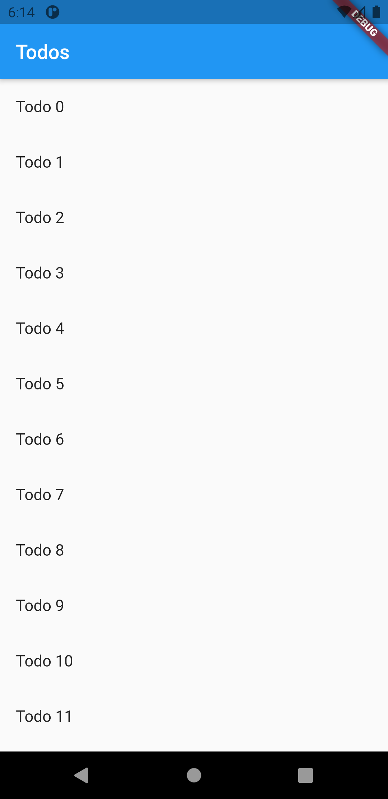

# send_data_to_new_screen

 you not only want to navigate to a new screen, but also pass data to the screen as well. For example, you might want to pass information about the item that’s been tapped.

<table>
  <tr>
    <td>Screen1</td>
     <td>Screen2</td>
  </tr>
  <tr>
    <td></td>
    <td></td>
  </tr>
 </table>